# Battleships-Network-Socket
**Distributed application of "Battleship" game type for local network in "client-server" architecture based on socket mechanism**

Description:

This program solves the problem of client communication through the server using the socket mechanism. The server waits for more than one user to connect to it, builds a map of ships and starts the game.
Users take turns writing coordinates of cells, those are checked by the server for hits and the results are sent broadcasting back to all clients. 
The battle map is dynamically rendered.
Live ships are counted. When their number is 0, the game ends and users are sent the game result and final score, after which they can disconnect from the server.

Choosing role:

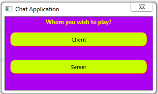

Server configuration:

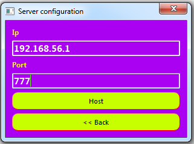

Server interface:

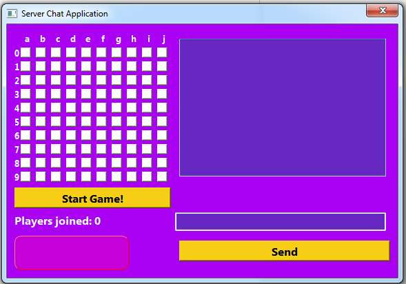

Player configuration:

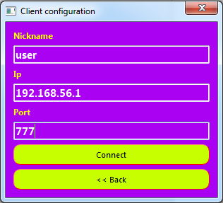

Players connected to the game:

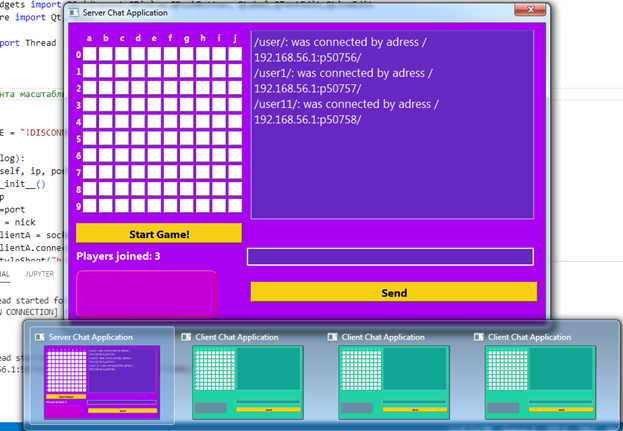

Dispaying messages in general chat:

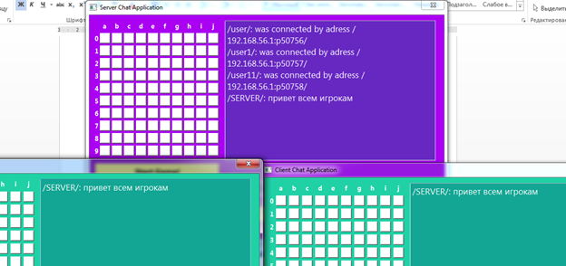

The server puts ships on the battlefield:

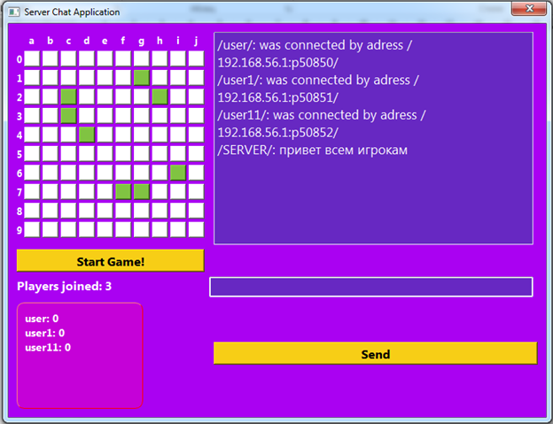

Player made a miss:

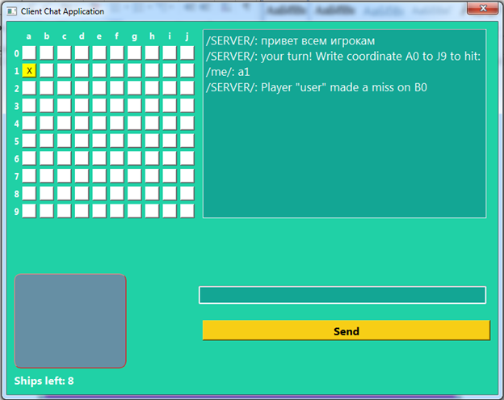

Displaying players activity on the server side:

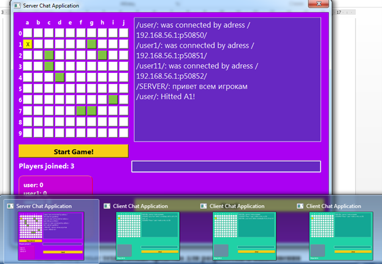

Player made a hit:

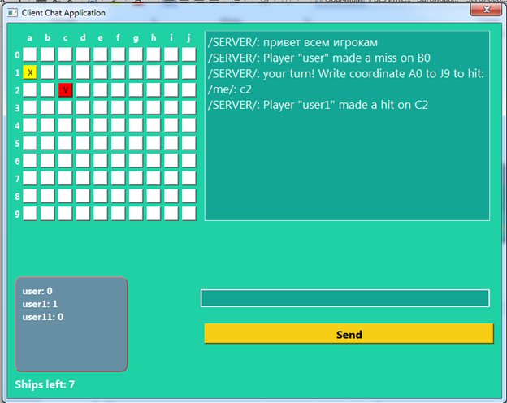

Game over as a winner:

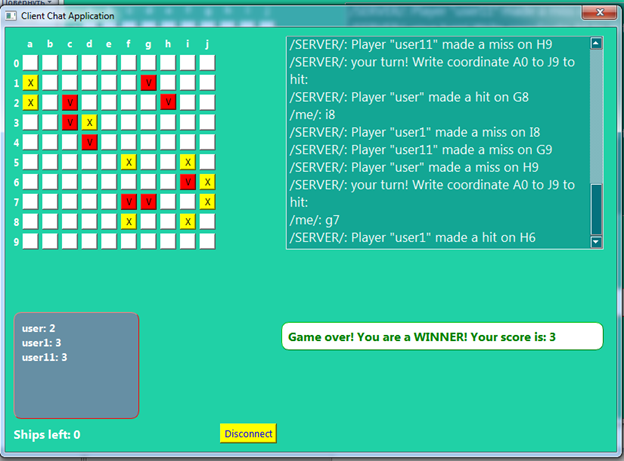

Game over as a loser:

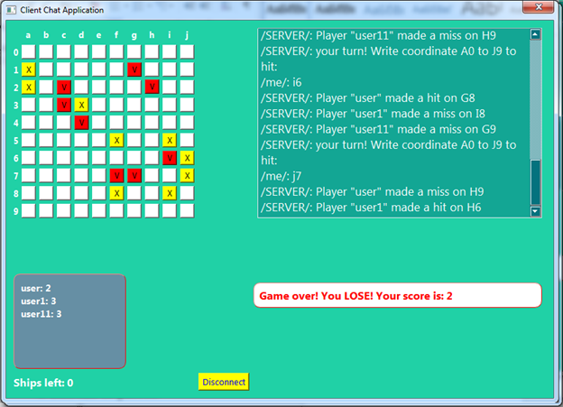
